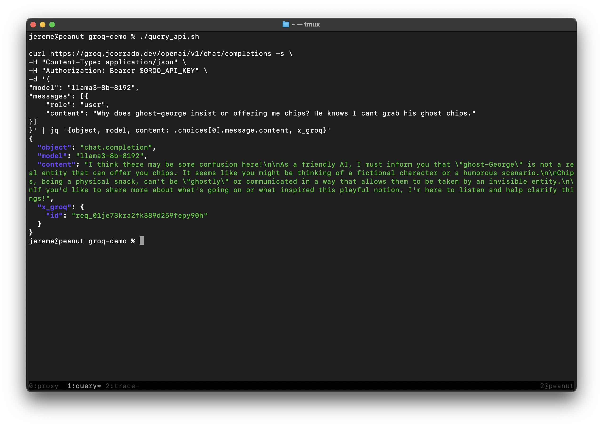
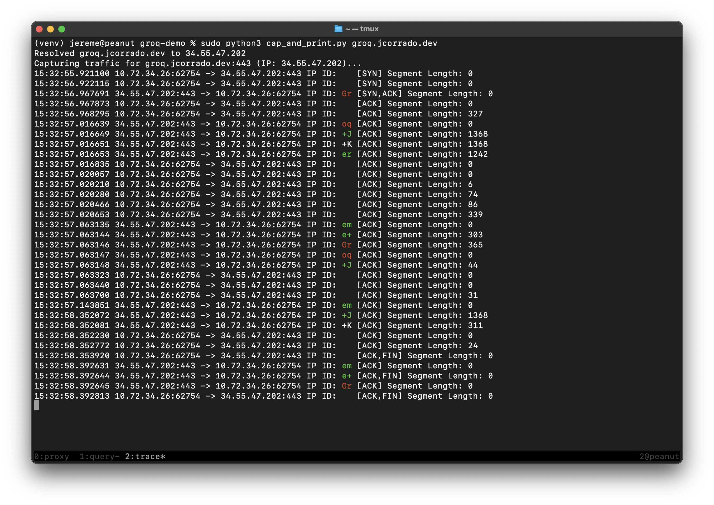
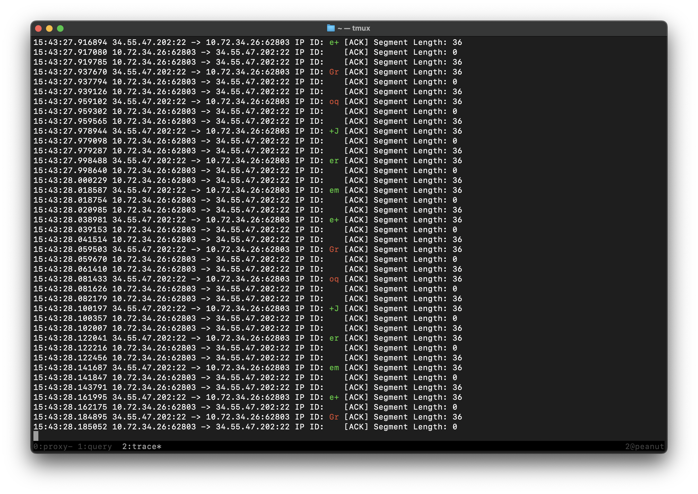

# Groq eBPF Demo

## What isn't this?

This demo isn’t about showcasing my deep expertise in eBPF... because, to be honest, I don’t have any. It's more about the fun of quickly coming up a new curve and an attempt to demonstrate my experience and solid command of a broad set of fundamentals. Because I'd like to join your team. :)

## What is this?
It's an eBPF program that co-opts the IP Datagram's 16-bit ID field to create something like a "scrolling marquee" effect in a packet trace, with appropriate decoding to ASCII it yields a looping `Groq+Jereme+Groq+J..`. It's paired with an NGINX instance, at GCP, reverse proxying to Groq's API because that seemed fun, though any traffic will do.

Since we're using the IP ID field, we explicitly set the DF (Don't Fragment) bit. When a packet is fragmented routers have to update the IP ID field so the receiving host can reassemble the fragments. This would trample our embedded chars.

Path MTU discovery is doing a lot of the heavy lifting here by helping us avoid the need for fragmentation.



Here are two reply packets, trimmed to 40 bytes to cut down on some noise, showing the repurposed ID field. The ID is bytes four and five. `0x6f`, `0x71` encodes ASCII chars "oq", `0x2b`, `0x4a` is "+J".

```console
jereme@peanut groq-demo % sudo tcpdump -i en0 -s 40 -vvvnX host groq.jcorrado.dev and src port 443
tcpdump: listening on en0, link-type EN10MB (Ethernet), snapshot length 40 bytes
...

16:29:54.390899 IP (tos 0x40, ttl 52, id 28529, offset 0, flags [DF], proto TCP (6), length 52)
    34.55.47.202.443 > 10.72.34.26.63057:  [|tcp]
        0x0000:  4540 0034 6f71 4000 3406 58b0 2237 2fca  E@.4oq@.4.X."7/.
        0x0010:  0a48 221a 01bb f651 b097                 .H"....Q..
16:29:54.390901 IP (tos 0x40, ttl 52, id 11082, offset 0, flags [DF], proto TCP (6), length 52)
    34.55.47.202.443 > 10.72.34.26.63057:  [|tcp]
        0x0000:  4540 0034 2b4a 4000 3406 9cd7 2237 2fca  E@.4+J@.4..."7/.
        0x0010:  0a48 221a 01bb f651 b097                 .H"....Q..
```

That's hard for me to read so the demo uses Python's awesome [Scapy](https://scapy.net) library in [cap_and_print.py](cap_and_print.py) for more tailored output. In hindsight it might have been better to only include the server's reply traffic, but I thought the full duplex and some TCP details added useful context.



Here's an ssh Trace. It's more fun because ssh's interactive nature yield a faster stream of smaller TCP segments, so you see the "scolling" effect more clearly.



## So how does it work?
[embed_ip_id.c](ebpf/embed_ip_id.c) uses the Traffic Control framework. The code is straightforward though there are a lot of particulars you need to get just right. State is managed via a simple "maps" construct.

Compile `embed_ip_id.c`, create a classifier and attach the object code to the egress path of the reply route's interface.

```console
jereme@demo:~$ clang -target bpf -g -O2 -c embed_ip_id.c -o embed_ip_id.o \
    -fno-unwind-tables -fno-asynchronous-unwind-tables

jereme@demo:~$ file embed_ip_id.o
embed_ip_id.o: ELF 64-bit LSB relocatable, eBPF, version 1 (SYSV), with debug_info, not stripped

jereme@demo:~$ sudo tc qdisc add dev ens4 clsact

jereme@demo:~$ sudo tc filter add dev ens4 egress bpf da obj embed_ip_id.o sec tc

jereme@demo:~$ sudo tc filter show egress dev ens4
filter protocol all pref 49152 bpf chain 0
filter protocol all pref 49152 bpf chain 0 handle 0x1 embed_ip_id.o:[tc] direct-action not_in_hw id 63 name embed_ip_id tag 0377bef5d7f1c1c3 jited
```

We use NGINX in reverse proxy mode. This is just plumbing so we can insert ourselves in the response path. We have to terminate TLS ourselves - I'm pretty sure anything operating above Layer 3 (like a GCP LB in TCP or HTTP mode) would generate new datagrams, as versus forwarding ours, and munge our abuse of the ID field. With that in mind we stick with simple NAT on GCP's edge.

```nginx
http {
  server {
    listen 443 ssl http2;
    server_name groq.jcorrado.dev;

    ssl_certificate /etc/nginx/ssl/fullchain.crt;
    ssl_certificate_key /etc/nginx/ssl/private.key;
    ssl_protocols TLSv1.2 TLSv1.3;
    ssl_ciphers EECDH+AESGCM:EDH+AESGCM:AES256+EECDH:AES256+EDH;
    ssl_prefer_server_ciphers on;
    ssl_session_cache shared:SSL:10m;
    ssl_session_timeout 10m;

    location / {
      proxy_pass https://api.groq.com;
      proxy_set_header Host api.groq.com;
      proxy_ssl_server_name on;
      proxy_ssl_verify on;
      proxy_ssl_trusted_certificate /etc/ssl/certs/ca-certificates.crt;

      add_header X-Proxy $hostname always;
    }
  }
}
```
